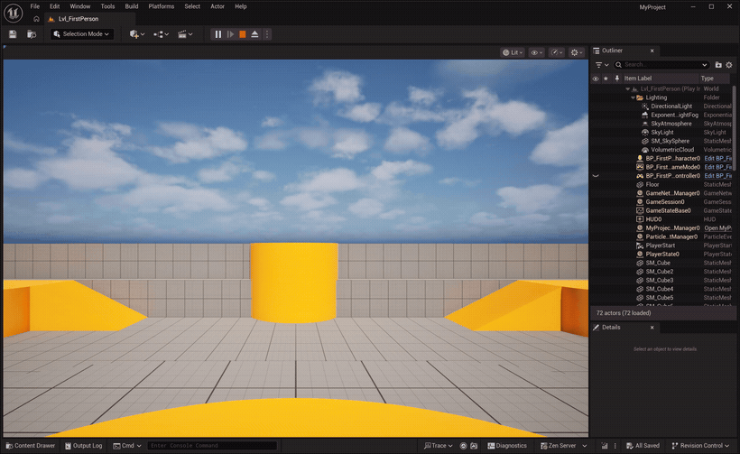

# windows-computer-use-mcp

<p align="center">
  
</p>

<p align="center"><em>Claude play-testing a live <strong>Unreal Engine</strong> project — entering Play-In-Editor and running up a ramp, driven entirely through this MCP. The full editor stays on screen, so you can see it really is the desktop app.</em></p>

<details>
<summary><strong>How that clip was made</strong> — one <code>play</code> call</summary>

A timed input script run at a cadence while the window is recorded (mouse-look is relative, keys are hardware scan codes, so the game responds). The raw input was exactly:

```python
play(
    target="window:MyProject - Unreal Editor",
    script="""
        lmb 557 460
        wait 0.4
        look 150 0
        wait 0.15
        look 150 0
        wait 0.2
        down w
        wait 1.7
        tap space
        wait 0.7
        up w
        wait 0.4
    """,
)
```

That is: click the viewport to capture the mouse (`lmb`), turn to face the ramp (`look`, relative pixels), run forward up it (`down w` … `up w`), and jump at the top (`tap space`).

</details>

A [Model Context Protocol](https://modelcontextprotocol.io) server that gives a Claude agent
**full control of the local Windows desktop** — native screen capture, low-level input
injection, video recording, and a play-test loop for driving games and apps.

Unlike Anthropic's sandboxed computer-use tool, this runs **on the machine it controls**: it
reads the actual current displays (no resolution requests), is **multi-monitor and per-monitor
DPI aware**, and injects input via `SendInput` **scan codes** so it works in games that ignore
synthetic virtual-key events. Built for full Claude control — no security gating.

## Why this exists

Anthropic's official [computer use in the Claude Code CLI](https://code.claude.com/docs/en/computer-use)
is a **macOS-only research preview** — Pro/Max only, interactive sessions only (not available with
the `-p` flag). The cross-platform alternative is the Claude Desktop app. There is **no official,
non-Desktop computer-use for Windows**: nothing you can drive headlessly from `claude -p`, from the
API, or wire into an agent over MCP.

This server fills that gap. It's a standard MCP server, so it works on Windows in Claude Code
(interactive **and** `-p`), in Claude Desktop, or from any MCP client / custom agent — with no plan
gating — and it's tuned for what a Windows agent actually needs that the sandboxed cloud tool can't
do: real multi-monitor capture, per-window GPU capture, game-grade input, and play-testing.

## Tools

| Tool | What it does |
|---|---|
| **`screenshot`** | See the screen: whole desktop, a `display:N`, a window (even occluded/DirectX via PrintWindow), or a region. Downscaled inline image + a coordinate frame for clicks. |
| **`act`** | Do input, batched: `left_click`, `type`, `key`, `scroll`, `drag`, `hold_key`, `paste`, `click_element` (UIA, no pixels), `mouse_move_relative` (game look), … Coordinates are in the last screenshot's image space; the server maps them to physical pixels. |
| **`record`** | Record N seconds → a single timestamped **frame montage** (not N images) + an mp4. Judge motion/animation/stutter. |
| **`play`** | Drive a **timed input script** at a cadence while recording (scan codes + relative mouse). `probe`/`until` read telemetry per sample and stop early — the closed loop for play-testing. |
| **`window`** | Find / focus / close / **read** (`get_text` via UI Automation + OCR) / `click_element` controls with **no screenshot** — token-cheap. |
| **`process`** | Launch (incl. `shell:true` for URLs / `ms-settings:` / Store apps), kill, wait, run a shell command (real stdout), and wait on readiness (`wait_for_window`, `wait_for_file`). |
| **`system`** | Monitor layout + DPI/scale, cursor position, clipboard get/set, and viewport management. |

### Coordinates & multi-monitor

Coordinates are physical pixels in virtual-desktop space (primary monitor's top-left is `(0,0)`;
monitors to the left/above are negative). You click in the **image space** of the last
`screenshot`; the server maps that back to physical pixels (handling downscale, per-monitor
offset, and DPI). Every screenshot returns a `capture_id`; `act` errors loudly if you click
against a stale frame instead of mis-clicking. Use `system displays` to see the layout, then
target a specific monitor with `display:0` / `display:primary|left|right`.

## Install

### As a Claude Code / Desktop plugin (recommended)

```
/plugin marketplace add sshh12/claude-plugins
/plugin install windows-computer-use@shrivu-plugins
```

The plugin bootstraps a Python virtual environment and installs this package from GitHub on
first run, then starts the MCP server automatically.

### Standalone (project-local MCP)

Requires Python 3.10+ and (for video) [ffmpeg](https://ffmpeg.org) on `PATH`.

```bash
pip install git+https://github.com/sshh12/windows-computer-use-mcp
```

Then add to your MCP client config (e.g. a project `.mcp.json`):

```json
{
  "mcpServers": {
    "windows-computer-use": {
      "command": "python",
      "args": ["-m", "windows_computer_use"]
    }
  }
}
```

## Development

```bash
python -m venv .venv
.venv\Scripts\python.exe -m pip install -e .
.venv\Scripts\python.exe tests\smoke_engine.py    # capture/input/display engine
.venv\Scripts\python.exe tests\smoke_server.py     # assembled MCP tool surface
```

`MCP_OUTPUT_DIR` overrides where screenshots/video are written (default: a client root →
`~/Pictures/windows-computer-use` → `%TEMP%`).

### Debugging

Set `WCU_DEBUG_HTML_DIR` to a directory and the server writes a per-session
`session_<stamp>.html` that pretty-prints every tool call — arguments, result text, and the
returned screenshots inline — so you can replay exactly what the agent saw and did:


## License

MIT
